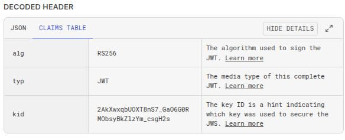
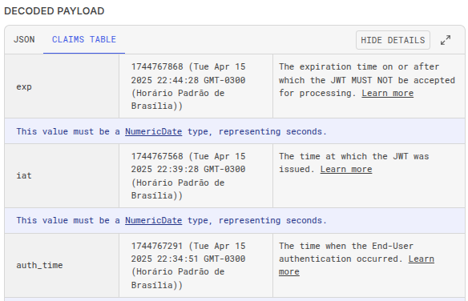
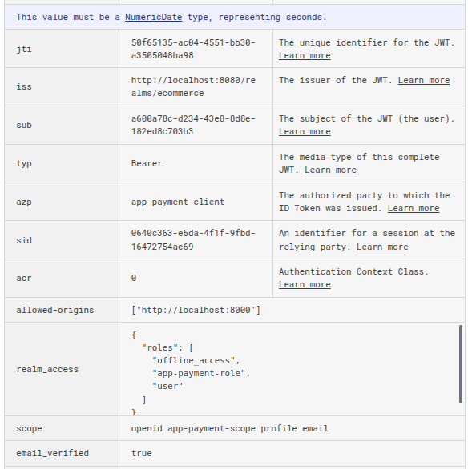
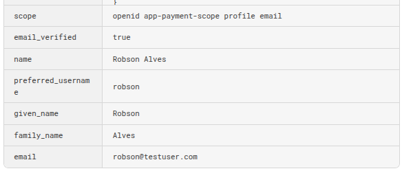

```bash
docker rm $(docker ps --filter 'label=br.dev.robsonalves.service.group=keycloak' -a -q) -f --volumes
docker compose -f docker-compose.yaml -f docker-compose.override.yaml up -d
```

```json
{
  "exp": 1744767868,
  "iat": 1744767568,
  "auth_time": 1744767291,
  "jti": "50f65135-ac04-4551-bb30-a3505048ba98",
  "iss": "http://localhost:8080/realms/ecommerce",
  "sub": "a600a78c-d234-43e8-8d8e-182ed8c703b3",
  "typ": "Bearer",
  "azp": "app-payment-client",
  "sid": "0640c363-e5da-4f1f-9fbd-16472754ac69",
  "acr": "0",
  "allowed-origins": [
    "http://localhost:8000"
  ],
  "realm_access": {
    "roles": [
      "offline_access",
      "app-payment-role",
      "user"
    ]
  },
  "scope": "openid app-payment-scope profile email",
  "email_verified": true,
  "name": "Robson Alves",
  "preferred_username": "robson",
  "given_name": "Robson",
  "family_name": "Alves",
  "email": "robson@testuser.com"
}
```
# Para ignorar o erro de script upload remover authorizationSettings
```txt
authorizationSettings
```




